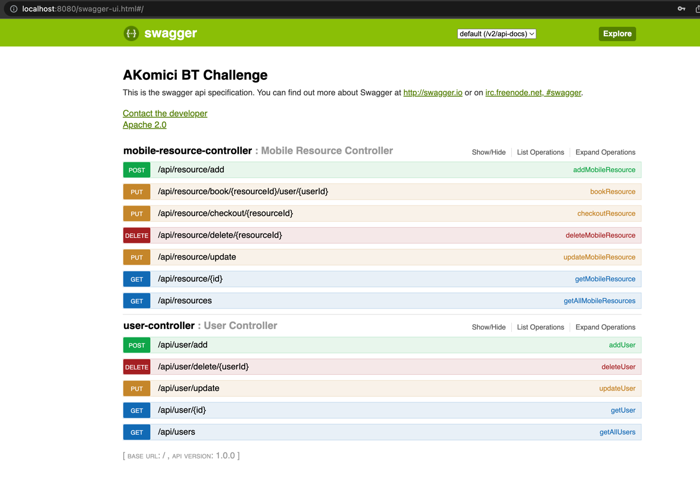

# Spring Boot application for Alban Komici BT Challenge

## Architecture

As the response for the [test/challenge](docs/BT_Backend_Test_Java_GG_v3.pdf),
the proposed delivery is a Spring Boot application using in memory database for the persistence.
The project is a structured as a maven project.

The Architecture is simple: The controllers , use Service components to gather and present the data.
The Services components, simplify the access to the persistence layer and aim to decouple the presentation layer form the persistence.
The Persistence layer is done by using Spring Data JpaRepositories.

## Exception/Error handling
In order to simplify exception handling and get rid of boilerplate code of chained try/catch doing almost nothing,
the project make use of Spring ControllerAdvice (see class ApiExceptionHandlerAdvice) in oder to map some unrecoverable
errors such as entity not found, or operation not permitted directly to ResponseEntity within the correct http-status and
response body indication the error occurred during the rest api calls.

## Tests

The application comes with integration tests which validate and test the rest endpoints exposed by the application,
so end-to-end test ( https status , http responses etc, that the data are persisted correctly etc)

Tests can be found in [src/test](src/test)

## Initialization
By default, through DBInitializer helper class, there are added some mobile resources as indicated in the challenge request.
DBInitializer is activated by spring profiles, so in order to omit these initial insertions  
make inactive the spring profile by deleting the following line in [application.properties](src/main/resources/application.properties)

```properties
spring.profiles.active=test-h2-db
```

## UML diagrams

The UML diagrams can be found in [docs/iml](docs/uml) , where the desired format can be chosen.

## Run Spring Boot application

first clean && build ( mvn clean install) and then run `./mvnw spring-boot:run`

```bash
./mvnw clean install spring-boot:run 
or
mvn spring-boot:run ( if already installed maven)
```


# Test Interactively the Api Endpoints

After running the application, open the browser into the swagger-ui page:
http://localhost:8080/swagger-ui.html#!/

and the following like page should open




From this page all the rest endpoints can be interactively used for testing

<br><br><br>

---
the end,<br>
Alban Komici , <br>
30/05/2023
--- 

